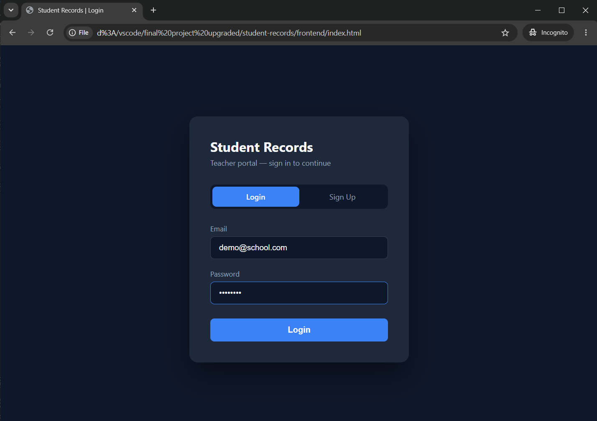
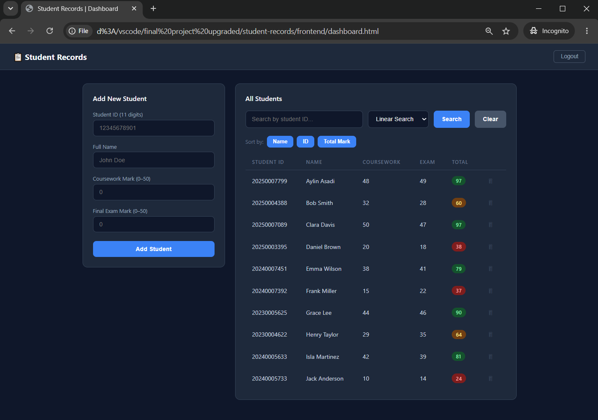
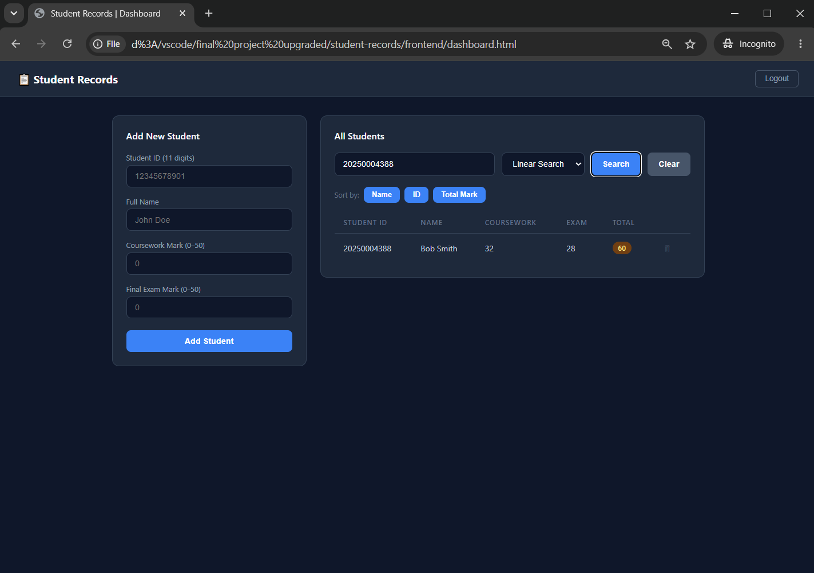

# Student Records System

This project started as my **Introduction to Computing Science 1 final project** — 
a command-line Python program for managing student records with manual input and 
console output. I then rebuilt and expanded it into a full-stack web application 
as a personal challenge to apply what I was learning beyond the course.

## What Changed from the Original
The original project was a single Python file that ran in the terminal. It covered:
- Adding student records via console input
- Bubble sort (by total mark), insertion sort (by name), selection sort (by student ID)
- Linear search and binary search by student ID

This version keeps all the same algorithms and logic, but adds:
- A real database (PostgreSQL) so records persist
- Teacher authentication with JWT (signup/login)
- A web interface instead of terminal input/output
- Docker and Docker Compose for simple setup and deployment.

## Features

- Teacher signup and login with JWT authentication
- Add and delete student records
- Search students by student ID
- Linear search and binary search by student ID implementations
- Bubble sort by total mark
- Insertion sort by name
- Selection sort by student ID
- Persistent PostgreSQL database storage
- Dockerized deployment

## Tech Stack
- **Backend:** FastAPI + SQLAlchemy
- **Database:** PostgreSQL
- **Frontend:** HTML, CSS, JavaScript
- **DevOps:** Docker + Docker Compose

## Demo Account
A demo account is created automatically on first run:
- **Email:** demo@school.com  
- **Password:** demo1234

Comes preloaded with 10 students so you can explore the app right away.

Screenshots:




## How to Run
1. Make sure Docker Desktop is installed and running
2. Clone this repo
3. Run:

```bash
docker-compose up --build
```

4. Open:

```
http://localhost:8000
```

5. Login using the demo account above.